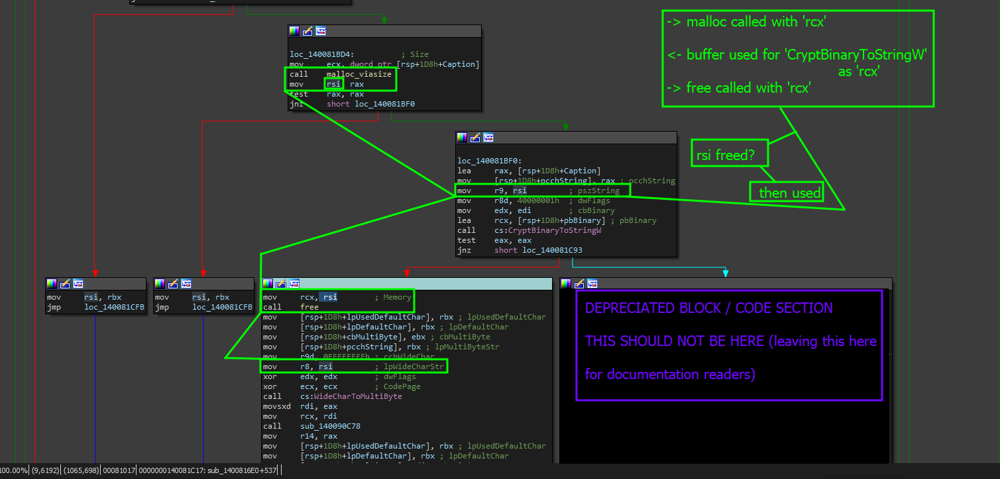

# Answer Page

### Answer to this objective.

There was a Use After Free (UAF) vulnerability that was found and verified within the code. The vulnerability existed in the following brick of code.

```
mov     rcx, rsi        ; Memory
call    free
mov     [rsp+1D8h+lpUsedDefaultChar], rbx ; lpUsedDefaultChar
mov     [rsp+1D8h+lpDefaultChar], rbx ; lpDefaultChar
mov     [rsp+1D8h+cbMultiByte], ebx ; cbMultiByte
mov     [rsp+1D8h+pcchString], rbx ; lpMultiByteStr
mov     r9d, 0FFFFFFFFh ; cchWideChar
mov     r8, rsi         ; lpWideCharStr
xor     edx, edx        ; dwFlags
xor     ecx, ecx        ; CodePage
call    cs:WideCharToMultiByte
```

And presented in this screenshot.&#x20;

<figure><figcaption></figcaption></figure>

> Reason this is a UAF

The reason this was deemed as a Use After Free vulnerability is primarily due to the factor that we are taking <mark style="color:red;">rsi</mark>, pushing it to <mark style="color:red;">rcx</mark> which is pushed to the stack as an  argument to the '<mark style="color:orange;">free</mark>' function then right after '<mark style="color:orange;">free</mark>' is called to free '<mark style="color:red;">rsi</mark>', '<mark style="color:red;">rsi</mark>' is then used again as an argument to the Windows API call <mark style="color:purple;">WideCharToMultiByte</mark>.

> How to patch this

The simple answer is to not use buffers or blocks of memory after they have been freed. If you need to reallocate that memory, you can clean it up and re-initialize the block if need-be but of course, that needs to be done safely.

