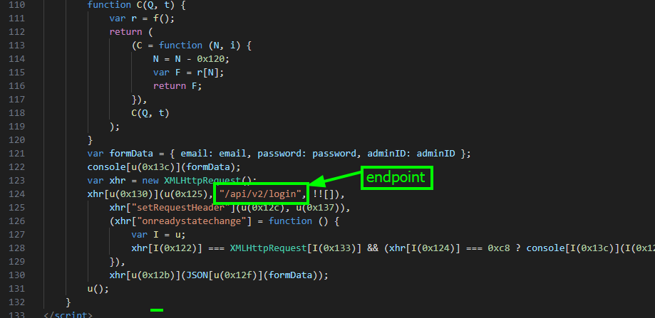

# Endpoints for login

### What is this task?

This task is asking us to find the endpoint at which the server sends login form data (_AdminID, Username, Password_) to and what this path does.

### Solving this task

Solving this task can be done in two ways- but we need to first take the **index.html** shipped with this application/paycheat and inspect it!&#x20;

#### Source code - Index.html

````markup
```html
<!doctype html><html lang=en><meta charset=UTF-8><meta content="width=device-width,initial-scale=1"name=viewport><title>REplay</title><script src=https://unpkg.com/feather-icons></script><div class=header><div class=header__logo><span>REplay</span></div><nav class=navbar><ul class=navbar__menu><li class=navbar__item><a class=navbar__link href=https://github.com/orgs/SkyPenguinLabs/repositories><i data-feather=home></i><span>Labs Page</span></a><li class=navbar__item><a class=navbar__link href=https://skypeguinsolutions.gitbook.io/replay-reverse-engineering-playground/introduction/what-is-replay><i data-feather=message-square></i><span>Writeups</span></a><li class=navbar__item><a class=navbar__link href=https://discord.gg/z63kU8tfbp><i data-feather=users></i><span>Community</span></a><li class=navbar__item><a class=navbar__link href=https://www.youtube.com/@SkyPenguinLabs><i data-feather=folder></i><span>YouTube (Trashy)</span></a><li class=navbar__item><a class=navbar__link href="https://www.google.com/search?q=totally_not_a_haxxer&tbm=isch&chips=q:totally_not_a_haxxer,online_chips:cyber+security:rsiqGGm3SGM%3D&hl=en-US&sa=X&ved=2ahUKEwijz5zUx5mEAxUhmbAFHW6UB54Q4lYoAXoECAEQNA&biw=1857&bih=966"><i data-feather=archive></i><span>Developer</span></a><li class=navbar__item><a class=navbar__link href=#><i data-feather=help-circle></i><span>What Is This</span></a></ul></nav></div><script>feather.replace()</script><body2><div class=session><div class=left></div><form autocomplete=off class=log-in id=loginForm><div class=floating-label><label for=email>Username:</label> <input autocomplete=off id=email name=email placeholder=Email></div><div class=floating-label><label for=password>Password:</label> <input autocomplete=off id=password name=password placeholder=Password type=password></div><div class=floating-label><label for=AdminID>AdminID:</label> <input autocomplete=off id=AdminID name=AdminID placeholder=xxx-xxxxx type=password></div><div class=greeting></div><div><button onclick=submitForm() type=button>Log in</button></div></form></div></body2>
<script>function submitForm() {var u=C;(function(Q,t){var F=C,r=Q();while(!![]){try{var N=-parseInt(F(0x13a))/0x1*(-parseInt(F(0x128))/0x2)+parseInt(F(0x136))/0x3*(-parseInt(F(0x132))/0x4)+-parseInt(F(0x134))/0x5*(-parseInt(F(0x13e))/0x6)+-parseInt(F(0x131))/0x7*(-parseInt(F(0x120))/0x8)+parseInt(F(0x129))/0x9+parseInt(F(0x13b))/0xa*(-parseInt(F(0x12a))/0xb)+parseInt(F(0x139))/0xc*(-parseInt(F(0x12d))/0xd);if(N===t)break;else r['push'](r['shift']());}catch(i){r['push'](r['shift']());}}}(f,0x6c2a7));var email=document[u(0x13d)](u(0x12e))[u(0x135)],password=document['getElementById'](u(0x121))['value'],adminID=document[u(0x13d)](u(0x123))[u(0x135)];document[u(0x138)](adminID+email+password);function f(){var s=['stringify','open','870898ddRapz','5312CqOWpj','DONE','230cFKJvr','value','1086AQGOJa','application/json','write','60MKFvLp','58605FYlsJZ','55010LLYklq','log','getElementById','85362XoYmoR','8vGEAqd','password','readyState','AdminID','status','POST','Login\x20successful','error','30ypsnUw','6514443bjEGYC','550NccHiX','send','Content-Type','3075605yntfOU','email'];f=function(){return s;};return f();}function C(Q,t){var r=f();return C=function(N,i){N=N-0x120;var F=r[N];return F;},C(Q,t);}var formData={'email':email,'password':password,'adminID':adminID};console[u(0x13c)](formData);var xhr=new XMLHttpRequest();xhr[u(0x130)](u(0x125),'/api/v2/login',!![]),xhr['setRequestHeader'](u(0x12c),u(0x137)),xhr['onreadystatechange']=function(){var I=u;xhr[I(0x122)]===XMLHttpRequest[I(0x133)]&&(xhr[I(0x124)]===0xc8?console[I(0x13c)](I(0x126)):console[I(0x127)]('Login\x20failed'));},xhr[u(0x12b)](JSON[u(0x12f)](formData));u();}</script>
<style>@import url(https://fonts.googleapis.com/css2?family=Open+Sans:wght@600&display=swap);.header,.header .navbar__link{color:var(--text);display:flex}.header .navbar__link,.header .navbar__link svg{transition:var(--transition)}button,input{-webkit-appearance:none}:root{--spacer:20px;--primary:#C4151C;--text:#fff;--linkHeight:calc(var(--spacer) * 3.5);--timing:250ms;--transition:var(--timing) ease all;--linkWidth:10rem}body{font-size:10px;background:center/cover #000;font-family:'Open Sans',sans-serif}.header{position:sticky;top:0;left:0;right:0;background:rgba(0,0,0,.9);padding:0 calc(var(--spacer) * 2);box-shadow:0 0 40px rgba(0,0,0,.03);height:6rem;align-items:center;gap:3rem}.header .header__logo{font-size:20px}.header .navbar{display:flex;align-items:center;height:100%;margin:0 auto;overflow:hidden}.header .navbar__menu{position:relative;display:flex}ul{list-style-type:none}.header .navbar__link{position:relative;flex-direction:column;gap:.6rem;align-items:center;justify-content:center;height:var(--linkHeight);width:var(--linkWidth);text-decoration:none;text-transform:uppercase}.header .navbar__link:hover svg{stroke:var(--primary)}.header .navbar__link:hover+&,.header .navbar__link:not(:hover)+&:focus{transform:translate(0)}*{font-family:-apple-system,BlinkMacSystemFont,"San Francisco",Helvetica,Arial,sans-serif;font-weight:300;margin:0}body2,html{overflow-y:hidden;overflow-x:hidden;height:50vh;width:100vw;margin:0;display:flex;background:#000}form{padding:40px 30px 20px;background:#fefefe;display:flex;flex-direction:column;align-items:center;justify-content:center}button{width:auto;min-width:100px;border-radius:24px;text-align:center;padding:15px 40px;margin-top:5px;background-image:linear-gradient(to right,#c4151c 0,#8a2be2 100%);color:#fff;font-size:14px;margin-left:auto;font-weight:500;box-shadow:0 2px 6px -1px rgba(0,0,0,.13);border:none;transition:.3s;outline:0}.session,input{background:#fff}button:hover{transform:translateY(-3px);box-shadow:0 2px 6px -1px rgba(182,157,230,.65)}button:active{transform:scale(.99)}input{font-size:16px;padding:20px 0;height:56px;border:none;border-bottom:1px solid #000;min-width:280px;box-sizing:border-box;transition:.3s linear;color:#000;font-weight:400}input:focus{border-bottom:1px solid red;outline:0;box-shadow:0 2px 6px -8px rgba(255,0,0,.45)}.floating-label{position:relative;margin-bottom:10px}.floating-label label{position:absolute;top:calc(50% - 7px);left:0;opacity:0;transition:.3s}.floating-label input:not(:placeholder-shown){padding:28px 0 12px}.floating-label input:not(:placeholder-shown)+label{transform:translateY(-10px);opacity:.7}.session{display:flex;flex-direction:row;width:auto;height:auto;margin:auto;border-radius:4px;box-shadow:0 2px 6px -1px rgba(0,0,0,.12)}.left{width:300px;height:auto;min-height:100%;position:relative;background-image:url("https://avatars.githubusercontent.com/u/121910566?s=200&v=4");background-size:180px;background-position:center;background-repeat:no-repeat;border-top-left-radius:4px;border-bottom-left-radius:4px}</style>
```
````

Since this is minified, we need to use a de-minifaction tool such as[ this](https://unminify.com/) one to format the code. Or you can use IDE tools like VScodiums _'format document'_ tool that comes with HTML development plugins.

When we analyze the form we notice the form calls the `submitForm()`  function which seems to be obfuscated. However, after analyzing the JS we notice this call here.

<figure><figcaption></figcaption></figure>

Alas: we have our endpoint.

### Verification

To verify this, we can use a dynamic analysis tool such as HxD to see if the API exists or is called and is used by the program. Since we have already used HxD to analyze and search + verify information in walkthroughs like [find-the-ctf-information-block.md](../../level-1-all-walkthroughs/find-the-ctf-information-block.md "mention") we are not going to go over it again.

### Answer

The answer to this question is that the server will make a <mark style="color:red;">HTTP POST</mark> request once the button is pressed and will relocate to <mark style="color:red;">"/api/v2/login".</mark> This indicates that the server is using <mark style="color:red;">version 2</mark> of its custom <mark style="color:red;">API</mark> and the <mark style="color:red;">login</mark> endpoint seems to be accepting <mark style="color:red;">HTTP POST</mark> requests.

