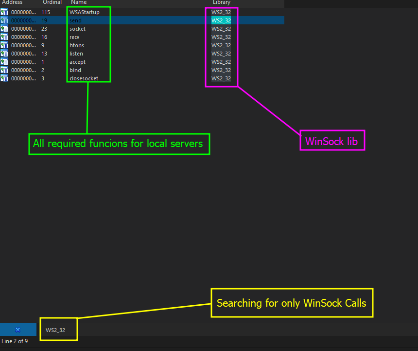
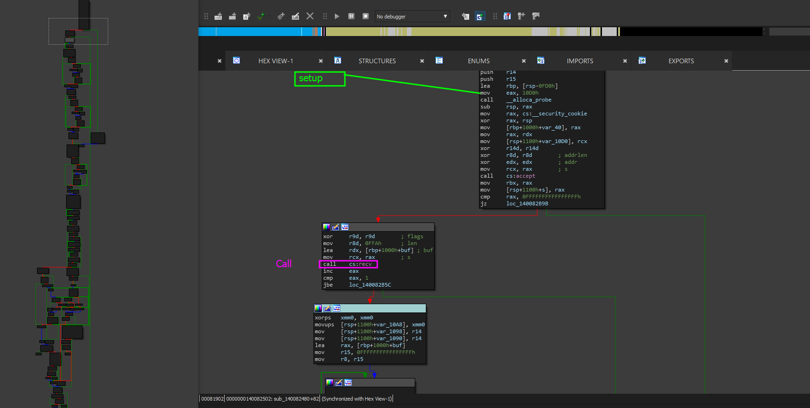
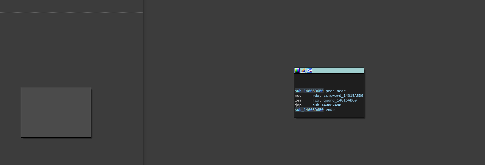
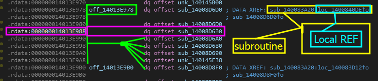
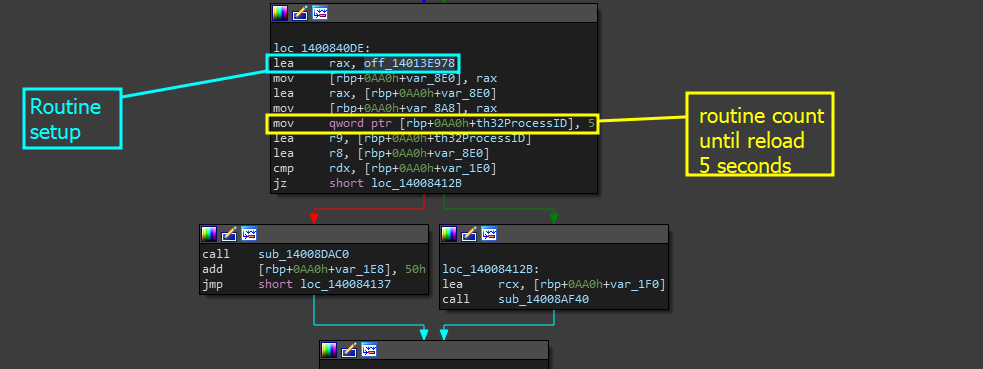

# Locating The Server Routine

Ideally, before we can even start finding information about the server and understanding what the server is doing, we need to first locate the routine and the original caller. Similar to how we did in [locating-the-thread-management-calls.md](../../locating-the-thread-management-calls.md "mention") and [locating-the-binary-integrity-system](../../section-1.0-binary-integrity-system/locating-the-binary-integrity-system/ "mention"). However, we will be using a different set of theory and methodologies that are unique to network specific applications.&#x20;

Just to make sure this is clear for understanding... here are some steps as to the importance of the original routine and the caller.

* **Analyzing the original caller:** This helps us verify that this is the server, tracing the original calls is going to be how we also understand its path. By understanding the functions one function is called through, we can accurately label each until we come to the end of their references.
* **Analyzing the individual calls:** Analyzing the individual callers and tracing them all will be a way to investigate the paths and the way data is being handled throughout the server.

For this page, we will be using the theory specified in ...


[methodologies-and-theory.md](methodologies-and-theory.md)


## Introduction

Within this application runs a local web server. This server, whilst not being directly told to you- is actively running a admin login panel for any admin or developer that wants to access user data. However, we want to analyze the data that the program is sending back and fourth and we also want to analyze any problems that can be leveraged in the future.&#x20;

We need to find and analyze this server! Lets gooo!

### Step 1 - Applying Theory

In the theory page, we explained how we can find and validate that a process is utilizing some form of port for remote TCP connections using that powershell script. Since we found that SkyOverlay is using a local TCP connection actively, we can trace down the functions and the server routine by tracing the calls imported from the `Ws2_32.dll` which is a library to specify the WinSOCK API. Lets check IDA-Pro and our import table to see what we have there.

<figure><figcaption></figcaption></figure>

Now, since we have different symbols- how do we know exactly what symbol to choose? Well that is our next step.

### Step 2 - Figuring A Start

Ideally, in real scenarios- the door is open to explore whatever we want and however we want to explore it. But for this scenario, we want to make sure we understand the core reasons to target specific functions in orders as it all depends on **where** we want to go and **what** our end goal is. &#x20;

#### Analyzing the "`send`" call

The `send` call is important for many reasons. This call is really used for sending back response or sending data to the socket- this can be used for displaying messages such as errors. Being able to view error messages and raw responses is pretty important- however, send can be used in a LOT of cases and it can be used to handle so many different things. So at first, it may distract us from our main goals.&#x20;

Confused about what our goals are for this section? Check the page linked below


[section-6.0.md](../../../replay-l1-3-goal-pages/level-2/section-6.0.md)


#### Analyzing the "`socket`" call

Analyzing socket calls are helpful for locating where a socket may be created, but in many scenarios- for both binary auditing and general reverse engineering, analyzing socket creation is only helpful for gaining insights on how the server is being configured.

It can give us insights into the protocol being used (_TCP or UDP)_ through symbols being loaded such as `AF_INET` and even protocol details. But for us, this is not superr relevant unless we want to see the setup for the server.&#x20;

#### Analyzing the "`htons`" call

`htons` is a function that is used to translates a short integer from host byte order to network byte order. This ensures that integers representing ports such as `8080` are populated and stored correctly. This function is definitely helpful to look at as it will give us a similar area to where data is being configured for the server or sorry what is being configured. This is where the sockets family, address and port is usually used in conjunction with `bind()` calls.

#### Analyzing the "`closesocket`" and "`Cleanup`" calls

Many servers usually have a cleanup function set external to the server itself- this is to ensure that when a connection is terminated and the server is no longer needed, that all the connections are properly closed and everything was deconstructed meaning nothing is just floating live data randomly in memory.

Ideally, analyzing these are not massive interests to us, but they certainly help us understand if the developer forgot to close the socket or closed it improperly. Usually, compiler optimization or security / warning systems will kick in (in some cases) but in more advanced scenarios, it may not be able to regulate that.

#### Analyzing the "`recv`" calls

Receive is a function that allows us to take data from the same socket and allow for the server to receive that data and store it in a buffer or some local variable. Understanding these calls and being able to locate them are SERIOUSLY important because they tell us where data is going, how data might be handled, filters that exist and more.

Here, we are definitely going to be analyzing the way data is being parsed and the way data is being received. This is the call we want to analyze.

So concluding this step, we want to first look at the `recv` call.

### Step 3 - Tracing The Recv call

Since we are going to be tracing the original caller before we sit and analyze everything, we want to analyze the one that is going to get us closest to the server itself- so we can trace the calls back to the original setup which is called by some other function. Right now, its a brainfuck, so lets sort through it.


Note that by this time, if you are this far, we will start being a little bit more faster pace with how we locate things. I should not have to explain how to list cross references and figure out where you are. If not, I highly suggest checking out GuidedHacking's courses and YouTube videos on IDA-Pro and how to use it to trace calls or refer to some of the other writeups.


When we find the cross references of the `recv` call which we found in the import table list we are eventually put onto this call.

<figure><figcaption>
Subroutine: <mark style="color:red;">sub_140082480</mark>
</figcaption></figure>

This subroutine seems to be receiving a ton of data- looking on the left side, you can see a massive CFG which means that this function is pretty extensive. For now, we are going to just ignore it until later and see where this function origin is traced to.&#x20;

To do this, find all cross references to <mark style="color:red;">sub\_140082480</mark> and click on the first occurrence in the `.text` section. When we do this, we eventually come across this block again similar to others.

<figure><figcaption>
Overview of: <mark style="color:red;">sub_14008D6B0</mark>
</figcaption></figure>

If you recall, these blocks are basically LAMBDA functions and whenever we list the cross references, we are thrown into the `.rdata` section of the binary. Recalling from the page linked below, all we have to do is find the offset at which this subroutine is grouped in and we can jump to the original routine.


[locating-the-thread-management-calls.md](../../locating-the-thread-management-calls.md)


When you trace it, you should see the image below.

<figure><figcaption></figcaption></figure>

Double clicking on the local reference brings you to this frame.&#x20;

<figure><figcaption></figcaption></figure>

As you can imagine, we are kind of confused here- because we do not expect our server to be constantly connecting and reconnecting and then disconnecting every 5 seconds- that is a dumb thing to do. So what exactly is our server doing? Well, the simple idea is that we did not exactly trace anything remotely ideal to the server itself outside of a simple `recv` function. However, this does bring us some insight.

Maybe what we came across was a processing function? The only way to find out is to investigate the structure of the previous code. For now, I will leave that up to you.&#x20;


Going back to the original call, make sure to analyze the messages, the symbols, the way data is being moved and what fields are being checked. Are there close socket functions? Are there functions that are used to set states? Maybe there are some standard HTTP return forms like '\r\n\r\r'.&#x20;


