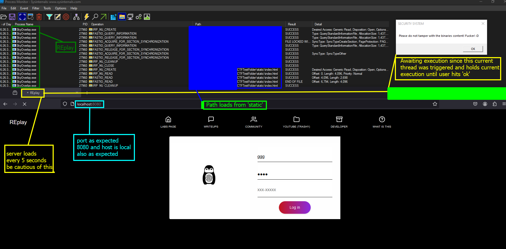
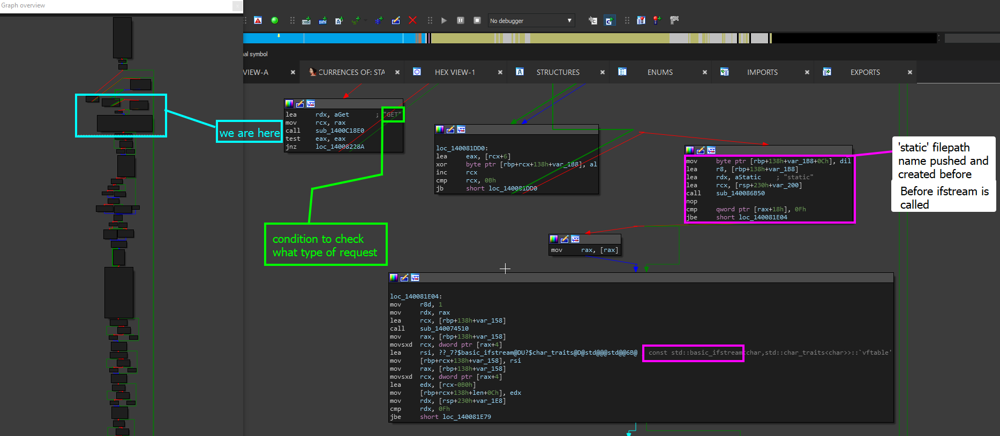

# Server folder for local file hosting

### What is this task?

This task is asking us to find the folder that the program loads the indexes or pages and data to serve from. This includes the HTML files, icons, and more.

### Solving this task

Solving this task evolves using process monitor to analyze the process and the server. Since we already discovered this server is local and has a port open on it which is port <mark style="color:red;">8080</mark> found using the process port scanning tool in [process-port-discovery.md](../../level-exploits-scripts/brute-forcing/process-port-discovery.md "mention")and verified by analyzing the `htons` functions in [server-port.md](server-port.md "mention").

The image below demonstrates this.

<figure><figcaption></figcaption></figure>


WARNING: This actually showcases the UI and web interface, ignore that this part was completed. In the real REplay, production ready and in a non-test environment, this page will just be blank and wont load.&#x20;


This image answers our question directly and also proofs some of the other stuff we found when statically analyzing this.

* **Step 1**: First load up process monitor
* **Step 2**: Filter for the playground process or manually add it as a filter
* **Step 3**: Start the capture and filter only for file related API calls
* **Step 4**: Load up the server which will cause the program to serve the file based on the endpoint.
* **Step 5**: Analyze the calls and events

### Verify&#x20;

We can imagine that this is the right path, but if you want to go deeper- we can see what paths may be triggered based on what request type. Check out this simple string trace lookup of "**static**" in the file.

<figure><figcaption></figcaption></figure>

### Answer

The answer to this is that the server grabs files from a folder called "**static**". We can also see this in the&#x20;
