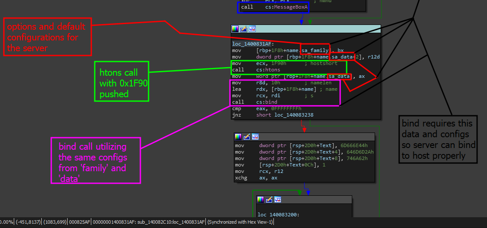

# Server port

### What is this task?

All this task is asking us to do is find the port the server is by default configured to connect to. Quite simple especially if you already checked the page below.


[methodologies-and-theory.md](locating-the-server-routine/methodologies-and-theory.md)


### Solving this task

In order to solve this task, we can analyze the `htons()` function in the server and the routine then verify its location and pick apart the arguments pushed before calling the function.&#x20;


Note that we already knew `htons` was called as we looked at it in the import table when [locating-the-server-routine](locating-the-server-routine/ "mention")


#### Step 1 - Locate and Analyze

The first step to this is to first go to the first location in which `htons` is being called. That so happens to be the location shown below.

<figure><figcaption></figcaption></figure>

Thankfully enough, this is actually exactly where we need to be. This entire screenshot captures our answer and proof that this is the right answer.

#### Step 2 - Summary&#x20;

The answer to this is `8080` by default configuration. This is because when we analyze the `htons` argument, not only do we see the only occurrence of `bind()` being used for the same exact configuration that also utilizes the `htons` function but we also know that the argument pushed to `htons` is <mark style="color:red;">0x1F90</mark> and that in decimal is <mark style="color:red;">8080</mark>. &#x20;
