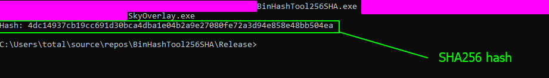

# Binary Hashing Tool

This tool was developed and designed for the [bypass-binary-integrity.md](../../level-2-all-walkthroughs/section-1.0-binary-integrity-system/bypass-binary-integrity.md "mention") section which teaches us how to bypass the binary integrity system by writing our own modifications to the hash file.

### What is this tool?

This tool is used as a hashing tool for binary applications. It allows us to take a binary we modified and get the new hash of the file. For our specific scenario, I decided to make sure this is PURE SHA256 and there is no salts or any additional settings, modifications or flags to the algorithm creation but this can be changed later if you need to.

### Code

Code is shown in the brick below. Note that this uses the Windows API and it requires a Windows machine. I personally compiled this tool using Microsoft Visual Studio and compiled in Release, X86.

```cpp
#include <iomanip>     // | Data conversions
#include <iostream>    // | For Stream Utils
#include <filesystem>  // | For File Utils
#include <fstream>     // | For File Control
#include <Windows.h>   // | For API calls

// We generate using a SHA256 as a basic hash
// Problem 1: this may be easier to detect and 
// may also be weaker but it serves as a good example 
static std::string GenerateSHA256(const std::string& FP) {
    std::ifstream IFileToGrab(FP, std::ios::binary);
    if (!IFileToGrab) {
        std::cerr << "Woops- could not open the given file...:" << FP << std::endl;
    }

    HCRYPTPROV hProv = 0;
    if (!CryptAcquireContext(&hProv, nullptr, nullptr, PROV_RSA_AES, CRYPT_VERIFYCONTEXT)) {
        // Maybe consider a non informative error here
        // something that can help resolve the issue :D
        return "";
    }

    HCRYPTHASH HashHashed = 0;
    // Create context for SHA256 creation
    if (!CryptCreateHash(hProv, CALG_SHA_256, 0, 0, &HashHashed)) {
        CryptReleaseContext(hProv, 0);
        // also: note: consider throwing a actual error
        // not just returning empty. This can be a problem
        return "";
    }

    const size_t BufSz = 4096;
    char Buf[BufSz];
    while (IFileToGrab.read(Buf, BufSz)) {
        if (!CryptHashData(HashHashed, reinterpret_cast<BYTE*>(Buf), IFileToGrab.gcount(), 0)) {
            CryptDestroyHash(HashHashed);
            CryptReleaseContext(hProv, 0);
            return "";
        }
    }

    DWORD HS_SZ = 0; // Size of hash current
    DWORD HSSZSZ = sizeof(DWORD);
    if (!CryptGetHashParam(HashHashed, HP_HASHSIZE, reinterpret_cast<BYTE*>(&HS_SZ), &HSSZSZ, 0)) {
        CryptDestroyHash(HashHashed);
        CryptReleaseContext(hProv, 0);
        return "";
    }
    std::string HashLol(HS_SZ, 0);
    if (!CryptGetHashParam(HashHashed, HP_HASHVAL, reinterpret_cast<BYTE*>(&HashLol[0]), &HS_SZ, 0)) {
        CryptDestroyHash(HashHashed);
        CryptReleaseContext(hProv, 0);
        return "";
    }
    // Destroy context so we can properly 
    // end the function and cleanup
    CryptDestroyHash(HashHashed);
    CryptReleaseContext(hProv, 0);
    return HashLol;
}

int main(int argc, char* argv[]) {
    if (argc != 2) {
        std::cerr << "Program Usage: " << argv[0] << " <file_path>" << std::endl;
        return 1;
    }
    std::string hash = GenerateSHA256(argv[1]);
    if (!hash.empty()) {
        std::cout << "Hash: ";
        for (unsigned char c : hash) {
            std::cout << std::hex << std::setw(2) << std::setfill('0') << static_cast<int>(c);
        }
        std::cout << std::endl;
    }
    return 0;
}
```

### Running this code&#x20;

To run the code, open a terminal, drag and drop the executable file for the hashing tool in the command line then drag and drop the file you want to hash onto the command line as well then hit enter. Should see something like this.

<figure><figcaption></figcaption></figure>
