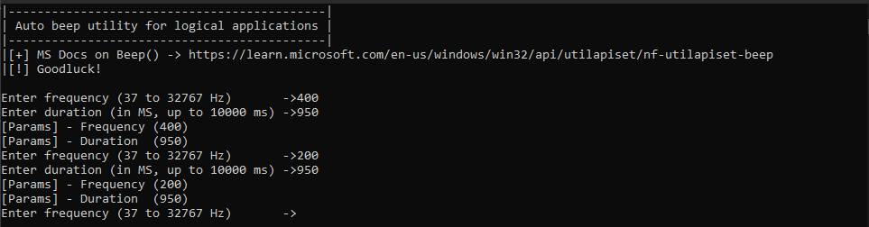

# Beeper Utility

This is for the utility used in [finding-functions-via-sound.md](../../level-2-all-walkthroughs/section-4.0-beeps-and-kinks/finding-functions-via-sound.md "mention"). This program is written in C++20, for Windows 10 and was compiled using MSVS or Microsoft Visual Studio.&#x20;

```cpp
#include <iostream>
#include <Windows.h>

void PB(int freq, int time) {
    if (freq > 37 && freq < 32767 && time > 0 && time < 10000) {
        std::cout << "[Params] - Frequency (" << freq << ")" << std::endl;
        std::cout << "[Params] - Duration  (" << time << ")" << std::endl;
        Beep(freq, time);
    }
    else {
        std::cout << "[Params] - ERROR (Frequency out of range)" << std::endl;
        std::cout << "[Params] - CONDITION (Frequency conditional) |(freq > 37 && freq < 32767 && time > 0 && time < 10000)|\n" << std::endl;
    }
}

int main() {
    int f, d;
    std::cout << "|--------------------------------------------|" << std::endl;
    std::cout << "| Auto beep utility for logical applications |" << std::endl;
    std::cout << "|--------------------------------------------|" << std::endl;
    std::cout << "|[+] MS Docs on Beep() -> https://learn.microsoft.com/en-us/windows/win32/api/utilapiset/nf-utilapiset-beep" << std::endl;
    std::cout << "|[!] Goodluck!\n" << std::endl;
    while (true) {
        std::cout << "Enter frequency (37 to 32767 Hz)       ->";
        std::cin >> f;
        std::cout << "Enter duration (in MS, up to 10000 ms) ->";
        std::cin >> d;
        PB(f, d);
    }

    return 0;
}
```

## Example Output

To run this code, just run the executable and enter the correct parameters. If you are able to pull the logic together enough, you can easily map out the frequencies and time other programs may be using for their own custom "beeps".

> **Note:** This really only applies to people that use the WinAPI \``Beep`\` function mainly because custom implementations may be using different sound systems for which you may need another utility to automate this with.

<figure><figcaption><p>Using the same length but the different frequency </p></figcaption></figure>

