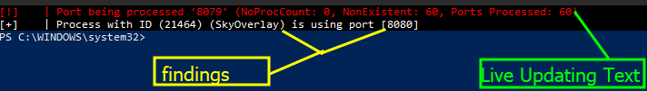

# Process Port Discovery

During Level2 exercises we are tasked to eventually find all information about a web server. But in real life scenarios, instead of just assuming there is a web server that is actually used, we need to verify that one is actively running. Since we are not always going to be on our feet with this and know exactly what port a service is running on ESPECIALLY if it is undocumented, then we can build a small utility that allows us to check for a specific process and see if it is using this process.

> Note: This script is utilized for the following page linked below.


[methodologies-and-theory.md](../../level-2-all-walkthroughs/section-6.0-networking-and-web/locating-the-server-routine/methodologies-and-theory.md)


## The Script

This scripts idea is to basically allow users to specify a process and a port range to and from a specific set of ports. When they run the script with the proper prams, they can scan and look for very specific ports running on a process and if they want to can even find other sub system services that the application might be using by also outputting that ports are being used by different system processes.

### Source Code

This application is developed using Powershell, a command/scripting language developed for task automation within the Windows (and other) system. Below, the source code to this script exists.

```powershell
param (
    [string]$pname,
    [string]$prange,
    [string]$verbose
)

function EnumerateProcessesOnPorts {
    param (
        [string]$processName,
        [string]$portRange
    )

    $ports = $portRange.Split("-")
    $sp = [int]$ports[0]
    $ep = [int]$ports[1]

    
    if ($sp -eq 0) {
        Write-Host "[+]    | Start range being set to 1"  -ForegroundColor Red -BackgroundColor Black
        $sp = 1;
    } 
    if ($ep -eq 0) {
        Write-Host "[+]    | End range being set to 65535" -ForegroundColor Red -BackgroundColor Black
        $ep = 65535;
    }

    $noProcessCount = 0
    $errorCount = 0
    $processedPorts = 0

    for ($port = $sp; $port -le $ep; $port++) {
        try {
            $processId = (Get-NetTCPConnection -LocalPort $port -ErrorAction Stop).OwningProcess

            if ($processId) {
                $owningProcess = Get-Process -Id $processId
                if ($owningProcess.ProcessName -eq $processName) {
                    Write-Host "`n[+]    | Process with ID ($processId) ($($owningProcess.ProcessName)) is using port [$port]" -ForegroundColor White -BackgroundColor Black
                } else {
                    Write-Host "`n[*]    | Port $port is being used by a different process ($($owningProcess.ProcessName))" -ForegroundColor Yellow -BackgroundColor Black
                }
            } else {
                $processedPorts++
                if ($verbose -eq "true") {
                    $noProcessCount++
                    Write-Host -NoNewline "`r[!]    | No process is using port $port. (NoProcCount: $noProcessCount, NonExistent: $errorCount, Ports Processed: $processedPorts)" -ForegroundColor Red -BackgroundColor Black
                }
            }
        } catch {
            $processedPorts++
            $errorCount++
            if ($verbose -eq "true") {
                #$($_.Exception.Message) 
                Write-Host -NoNewline "`r[!]    | Port being processed '$port' (NoProcCount: $noProcessCount, NonExistent: $errorCount, Ports Processed: $processedPorts)" -ForegroundColor Red -BackgroundColor Black
            }
        }
    }
}

function Helpmen {
    cls
    Write-Host "|----------------------PortDetection---------------------------|"
    Write-Host "| Usage | AutoPortDetect.ps1 -pname" 
    Write-Host "|                                  <process_name>"
    Write-Host "|                            -prange"
    Write-Host "|                                  start-end"
    Write-Host "|                            -verbose"
    Write-Host "|                                  true || false"
    Write-Host "|"
    Write-Host "| Demo  | AutoPortDetect.ps1 -pname SkyOverlay -prange 8080-8090"
}


function Main {
    param (
        [string]$processName = "",
        [string]$portRange = "8080-8090"
    )
    if ($processName -eq "") {
        Helpmen
    } else {
        EnumerateProcessesOnPorts -processName $processName -portRange $portRange
    }
}

Main -processName $pname -portRange $prange
```

### Usage

The usage of this script is pretty simple.&#x20;

* **Process name**: In order to get started, you should specify a process name which is required. To do this, use the key `-pname` followed by the process name without the file extension. For example `-pname SkyOverlay` will allow you to specify the process `SkyOverlay` .
* &#x20;**Port Range:** The second most helpful tool is going to be the port range specification. You can tell the script to start and end at a specific range using the `-prange` argument. To do this, simply specify the port range like so - `-prange portx-porty` which will tell the program start at `portx` and end at `porty`.
* **Verbosity**: If you want more error messages, use the `-verbose` flag with the string `true` to define that you want verbose error messages. Else, then leave it be.

### Demonstration

For this demonstration, we will be targeting this CTF. To do that. run the following command to see this script in action.

`AutoPortDetect.ps1 -pname SkyOverlay -verbose true -prange 8020-8080`

This brings the following result.

<figure><figcaption></figcaption></figure>

As figures, we found a port running on the overlays process which was port 8080.&#x20;
