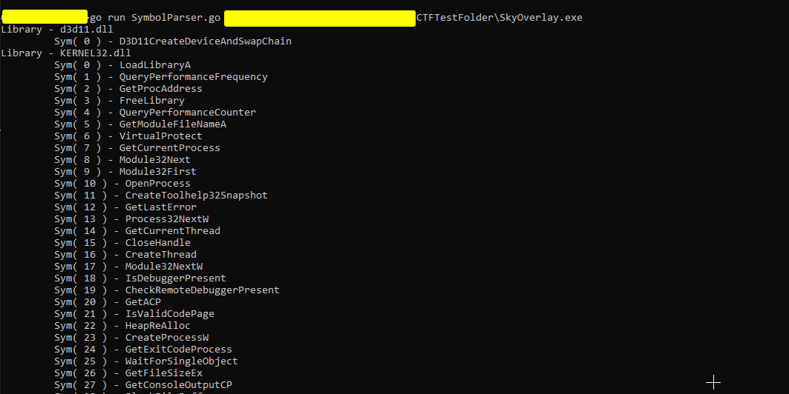

# Import Parser \[Go]

### What?

This utility is a simple PE parser in Golang that uses the `debug/pe` library to output all the symbols imported under a specific library from a PE file. Its quite simple and is also error prone which is why I did not include it in the main course for this but I still wanted to toss it out there as an experiment.

Ideally, this tool can be modified to check specific symbols that may be of interest such as `IsDebuggerPresent` and various other symbols.

### Source

Below is the source code to the program

```go
package main

import (
	"debug/pe"
	"fmt"
	"os"
	"strings"
)

type PEData struct {
	Handle      *os.File            // Handle to the file
	Filename    string              // Filename we are loading- not necessary but good to keep in mind
	LibsToFuncs map[string][]string // All libs carry an array of imported functions
}

var (
	PED PEData
)

func CE(x error, m string) {
	if x != nil {
		fmt.Println(m + x.Error())
		os.Exit(0)
	}
}

func ElemExists(arr []string, target string) bool {
	for _, elem := range arr {
		if elem == target {
			return true
		}
	}
	return false
}

func ParsePE(filename string) {
	var x error
	PED.Handle, x = os.Open(filename)
	CE(x, "[-]     | Error opening file - ")
	defer PED.Handle.Close()
	parsed, x1 := pe.NewFile(PED.Handle)
	CE(x1, "[-]    | Error parsing PE file - ")
	IT, x2 := parsed.ImportedSymbols()
	CE(x2, "[-]    | Error grabbing the imported symbol list - ")
	PED.LibsToFuncs = make(map[string][]string, 0)

	// Init modules in map
	for _, module := range IT {
		splti := strings.Split(module, ":")
		module := splti[1]
		_, exists := PED.LibsToFuncs[module]
		if !exists {
			PED.LibsToFuncs[module] = []string{}
		}
	}

	for _, symbol := range IT {
		split := strings.Split(symbol, ":")
		mod := split[1]
		sym := split[0]
		if v2, ok := PED.LibsToFuncs[mod]; ok {
			if !ElemExists(v2, sym) {
				PED.LibsToFuncs[mod] = append(PED.LibsToFuncs[mod], sym)
			}
		}
	}

}

func main() {
	if len(os.Args) != 2 {
		fmt.Println("[-]    | go run main.go <fname>")
		os.Exit(0)
	}
	ParsePE(os.Args[1])
	for k, v := range PED.LibsToFuncs {
		fmt.Println("Library - " + k)
		for c, symbols := range v {
			fmt.Println("\t Sym(", c, ") - "+symbols)
		}
	}
}
```

### Output / Example

Running this tool is pretty simple. Call the Go compiler followed by the filename and then the PE file you want to scan!

For this example, we will be using REplay.

<figure><figcaption></figcaption></figure>

In this example, there was over 150+ imports discovered. However the flaw remains in that of the way that Golang parses the PE import table. I read somewhere that sometimes, Golangs debug/pe path will not exactly pick up on every single library and may occasionally mess up with imports like `Ws2_32.dll` which is used for sockets and other forms of tools for networking.

