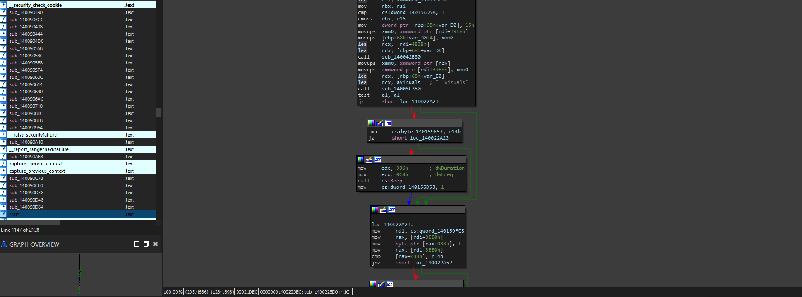

# Using Tabs

In order to get to where we want to go, I think our best bet considering the structure and layout of the buttons on the GUI, is to try and utilize what we saw previously (the tab names in plaintext) to be able to find and locate the main button function.


Note that when going to look for buttons on GUIs, you can check various areas that may indicate a function is being used for the same setup.\
\
For example: We know when using the GUI that the buttons blink the same, have the same click transition, same result and same speed in rendering. This could indicate the use of the same button rendering function. &#x20;


### What do I do for this one?

If you do not know how to locate the tabs by now, it is probably vital that in order to understand this, you need a little bit more fundamental knowledge in RE. Try checking out and running through [level-1-all-walkthroughs](../../../level-1-all-walkthroughs/ "mention")to learn more.

If you did everything right, you should see this similar portion of the program in IDA. Ideally, you should also be in subroutine - `sub_1400225D0`

<figure><figcaption></figcaption></figure>

