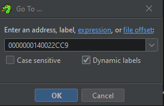
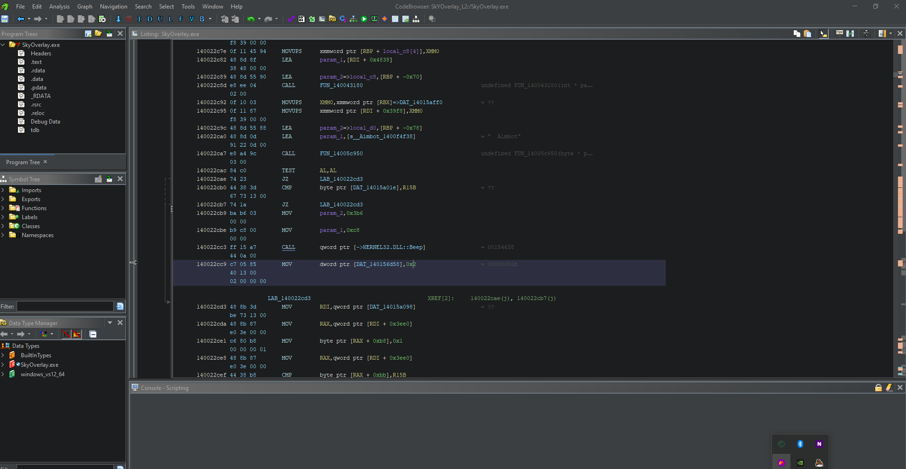

# File Offset & Patching

## Tampering With Tabs

Now we need to get into a specific area we want to change such as the '_aimbot_' button tab. For this scenario, I basically will be finding the value of the '_aimbot_' tab and then switching it with the '_visuals_' tab.&#x20;

### Finding the correct info

In order to do this, go back to the brick that assigns the number. In this case, for me, that value is the one below.

```
mov     cs:dword_140156D58, 2
```

Since this '2' is the tab number that is checked to render the aimbot tab, we can switch it to the tab number 1.&#x20;

### Using Ghidra

As mentioned in previously statements, using IDA does not always work for patching. This is because without plugins, IDAs generic engine even in Pro was only designed to support specific sets of instructions. This is the one downfall we do have. To get around this- you can go two primary ways.

* <mark style="color:blue;">**Using other tools like Ghidra**</mark>**:** This is a simple get around, simply find the file offset, copy the file offset into Ghidras code browser and then edit the code there.
* <mark style="color:blue;">**Using plugins**</mark><mark style="color:blue;">:</mark> There are plugins for IDA [KeyPatch ](https://github.com/keystone-engine/keypatch)which can also be used for better patching moments and keep you within IDA.

For our scenario, we will be using Ghidra for this as we have in the past. So find the line of code we need to edit and get the file offset.


It is important noting that getting the file offset of the instruction that you want to change is mainly going to be done in the text view of IDA. Usually, it is on the far left side and starts off with the section name like <mark style="color:purple;">`.text`</mark>.


### The offset in Ghidra

For me, the offset for the line we want to edit  is `.text:0000000140022CC9` as indicated in the code section below.

```
.text:0000000140022CA0                 lea     rcx, aAimbot_0  ; "  Aimbot"
.text:0000000140022CA7                 call    ImGui_Button
.text:0000000140022CAC                 test    al, al
.text:0000000140022CAE                 jz      short loc_140022CD3
.text:0000000140022CB0                 cmp     cs:byte_14015A01E, r15b
.text:0000000140022CB7                 jz      short loc_140022CD3
.text:0000000140022CB9                 mov     edx, 3B6h       ; dwDuration
.text:0000000140022CBE                 mov     ecx, 0C8h       ; dwFreq
.text:0000000140022CC3                 call    cs:Beep
.text:0000000140022CC9                 mov     cs:dword_140156D58, 2
.text:0000000140022CD3
```

Now we need to take the offset and throw it into Ghidra. I am going to be using the standard `G` hotkey to get to the 'goto' menu for navigation.

<figure><figcaption></figcaption></figure>

When we hit 'ok' we get brought to the following screen.

<figure><figcaption></figcaption></figure>

In the line you were brought to- press the keybind : `Ctrl+Shift+G` and that will bring you to the system that allows you to edit the line .

