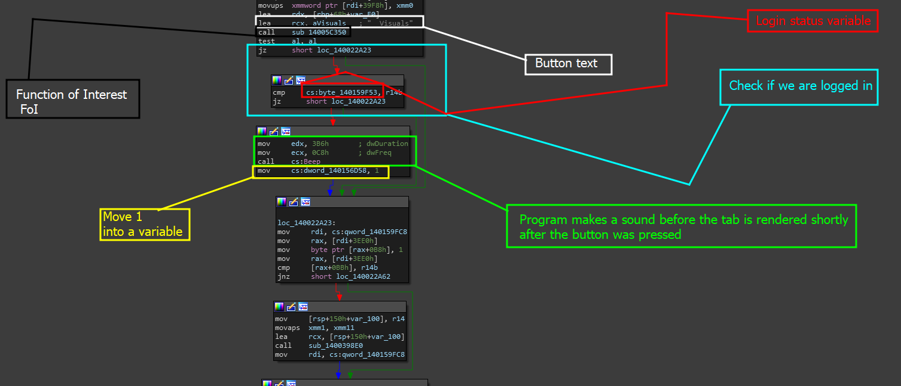

# Initial Analysis

Since we have a specific brick we can look at- lets go ahead and re-open the screenshot in a more graphical manner. This will help us analyze what is happening here and what we need to do to change it.

### Image and Analysis

Below is our function of interest.

<figure><figcaption></figcaption></figure>

This function set of interest contains a few nice little groups. Lets go through them.

* <mark style="background-color:green;">Black</mark>: Black is interesting to us and is another function of interest that we want to explore. The reason we want to explore this is due to the fact that the text for the name of the left hand side button to render the ESP info is the same here and seems to be calling a function right after its being pushed like all the others. It also seems to be testing a return result.
* <mark style="color:blue;">Blue</mark> & <mark style="color:red;">Red</mark>: Blue and red are not nothing new to us. As we explored in the [crippling-logins.md](../../../level-1-all-walkthroughs/bypass-entirely-login-system/crippling-logins.md "mention"), the GUI will check the singular byte status (1 or 0 || true or false) to see if we have logged in yet then it will jump to the next loop which defines green.&#x20;
* <mark style="color:green;">Green</mark>: Semi interesting but more informal than anything. In previous sections such as [section-4.0-beeps-and-kinks](../../../level-2-all-walkthroughs/section-4.0-beeps-and-kinks/ "mention"), we explored that this program has a beep every single time you are logged in (or set the global status to true for the login) the frequency will play and the tab will render. This is extremely helpful for context.
* <mark style="color:yellow;">Yellow</mark>: Yellow is more interesting to us, because after the code in the green is executed, we set a quad word to 1 which tells me that if this is contained in every other condition for each button and tab rendering, then this might be the status we need to analyze.

Now, lets check to see if the FoI is probably the button.

### Checking for buttons

Something we knew before or throughout the writeups was that the playground used ImGUI as a GUI library for C++ Windows10 relying on D3Dx11.&#x20;

This is important to us because when reverse engineering what we believe to be GUI widgets, we can go into the source code and create some form of bridge between what is and what does not make this the widget.&#x20;

In this case, we open the function but around the end of the function we come across this brick of code which if you are a developer familiar with this library kinda catches your eyes.

<figure><figcaption></figcaption></figure>

<mark style="color:blue;">**What catches my eyes as a developer is**</mark>** '\[' and ']'** being used. The reason it does is because coming from my experience and reversing game cheats (**most which use ImGUI**) ImGui often templates code and uses brackets as strings to also enclose new pieces of code or data that is being used on the backend of this.&#x20;

_<mark style="color:blue;">**The second thing**</mark>_ that catches my eye is that '_al_' which is notorious for being a return value for Boolean or byte return based functions, is xored by itself indicating for the return code of 0. This may indicate that the function is checking a specific set of data and mechanisms and returning Boolean statuses based on the state.&#x20;

<figure><figcaption></figcaption></figure>

## Renaming and semi-verifying

As we can imagine, we can not always see the state of the function and know exactly what it is doing at every given moment. However, we can assume. Considering the current evidence, it all points to the fact that this function may in fact be the button call. So lets rename it to - `Maybe_ImGuiButton` and check the results.

> After naming the function check XREFs and you should get the following

<figure><figcaption></figcaption></figure>

This shows us that these may be the tab. As looking at the menu shows us that there are only 5 main buttons in this address location.


Note that when there are many different variations of a function, you may have entire sets of functions that do basically the same thing in a different manner. I have noticed this as well coming across buttons.


If you check the results you see other tab buttons that also have the same function name now.

<figure><figcaption></figcaption></figure>

### Now what?

Basically, now that we know where our buttons are, we can also figure out that the bytes being moved around and shifted might be the status we need to change. In order to do that, we need to analyze similarities in the context in which the dword value is used.

&#x20;In order to do that, we can simply highlight the DWORD var name which is `dword_140156D58` and of course we can see where it is being used.&#x20;

### Analyzing patterns

If you did what you were supposed to above, you may have gotten the following list.

```
mov     cs:dword_140156D58, 1   // Visuals
mov     cs:dword_140156D58, 2   // Aimbot
mov     cs:dword_140156D58, 3   // Misc
mov     cs:dword_140156D58, 14h // login 
mov     cs:dword_140156D58, 13h // '?' tab
```

With this data here, you can clearly see the pattern here. Login and the other tab do have weight but do not at the same time. The question tab we knew was a bit buggy to begin with and plus its still being pushed to the value anyway. But either way- the pattern is that this value is not only used when the buttons are pressed but also used to render the window too as the code pretty much checks this value to see if the tab value is equal to any of the known.

An example of the check is the value of `dword_140156D58` which has been renamed to `TabNum` is the screenshot below demonstrating a comparison to 0x01 or 1 indicating the program is checking for tab number 1.

<figure><figcaption></figcaption></figure>

As you can see here, the comparison and the result is pretty obvious here.
